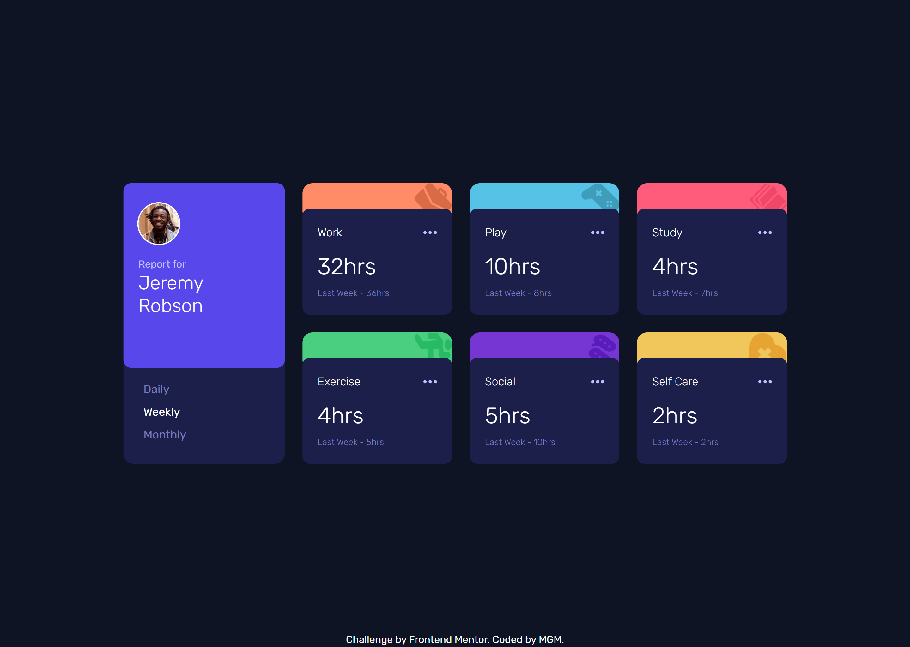

# Frontend Mentor - Time tracking dashboard solution

This is a solution to the [Time tracking dashboard challenge on Frontend Mentor](https://www.frontendmentor.io/challenges/time-tracking-dashboard-UIQ7167Jw). Frontend Mentor challenges help you improve your coding skills by building realistic projects. 

## Table of contents

- [Overview](#overview)
  - [Screenshot](#screenshot)
  - [Links](#links)
- [My process](#my-process)
  - [Built with](#built-with)
- [Author](#author)

## Overview
Time Tracking Dashboard

### Screenshot

### Links

- Solution URL: [Solution URL]()
- Live Site URL: [Github Pages]()

## My Process

### Built with

- HTML5
- JavaScript
- Tailwind CSS

## Author

- Website - [Mariella Monacillo](https://mariellamonacillo.netlify.app)
- Frontend Mentor - [@ellamonacillo](https://www.frontendmentor.io/profile/ellamonacillo)
